# tutorial-automation-testing-java-basic
---

### Description:
This repo contains the basics of automation testing and java which will covered as a part of Automation Testing Online Training.

---

#### Tutorials on: 
* Automation Testing Basics 
* Java Basics
* Create Maven Project

---
#### Author:
* Created By: Akash Tyagi. 
* Reach me out at: akashdktyagi@gmail.com

---
#### Required Installations:

* For Selenium with Java Automation, you need below softwares:

* JDK-Java Development Kit: https://www.oracle.com/in/java/technologies/javase-downloads.html
* Eclipse: https://www.eclipse.org/downloads/
* Maven: https://maven.apache.org/download.cgi
    * Download this file: apache-maven-3.6.3-bin.zip
* Step by Step instruction to install maven: https://mkyong.com/maven/how-to-install-maven-in-windows/
* Git: https://git-scm.com/downloads


---

#### Ground Rules

* Target to spend at least 20 hrs per week. Use tools like this to track: https://clockify.me/
* Complete the Workshops and Assignments on time.
* Present your learning in the form demos.
* Do lot of self reading.
* Pre-Reading of the Topic.
* Learn Less, Do more.
* Do not focus on how many topics you have learnt rather focus on the depth of what you are learning.
*

---
#### Tutorials - Slides - Automation Testing Basics, Java Basics, Create Maven Project

>

>

>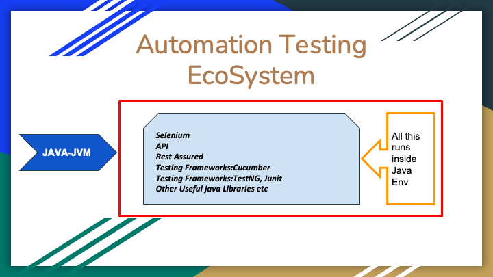

>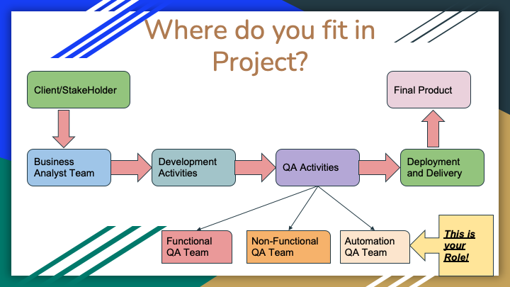

>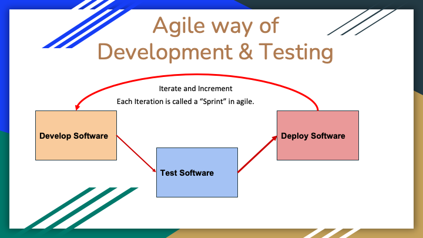

>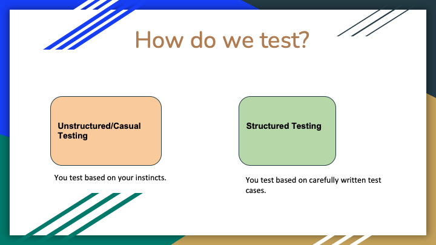

>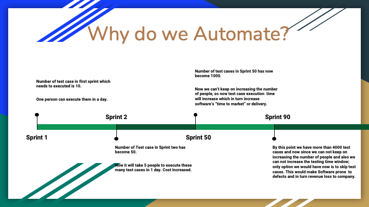

>

>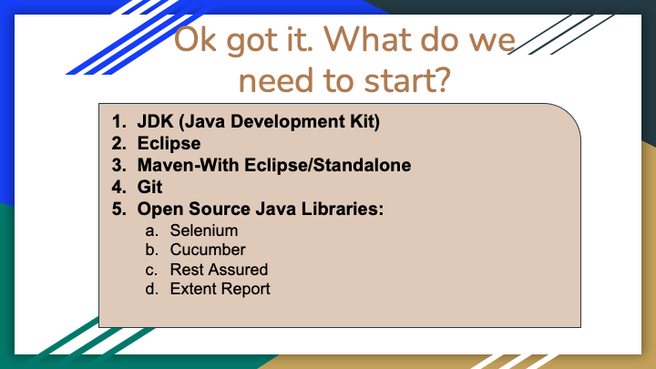

>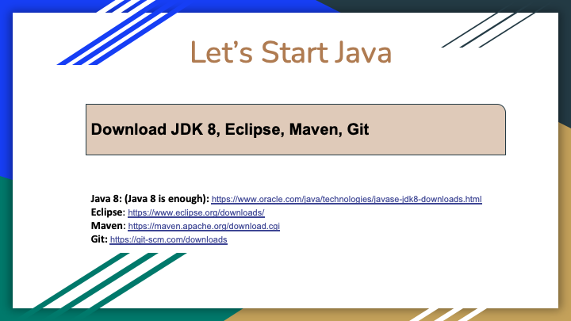

>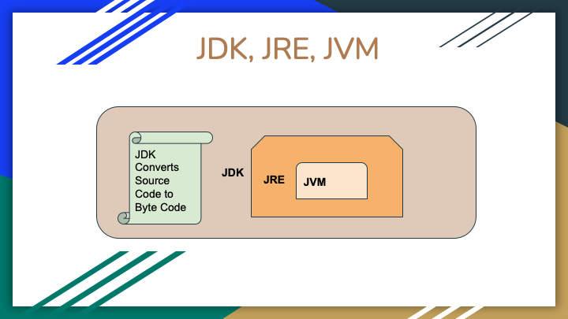

>

>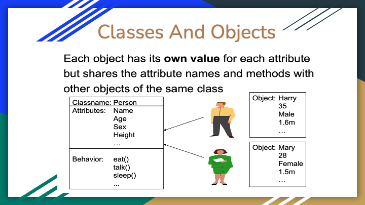

>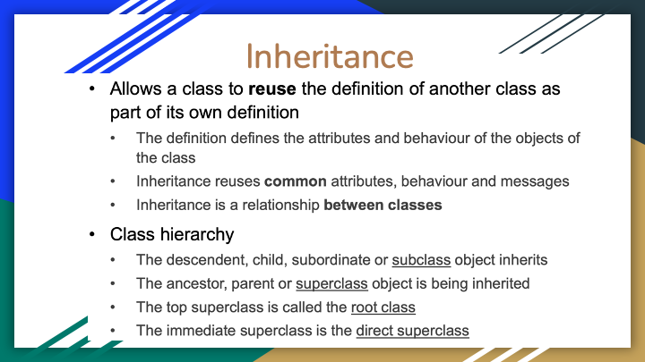

>

>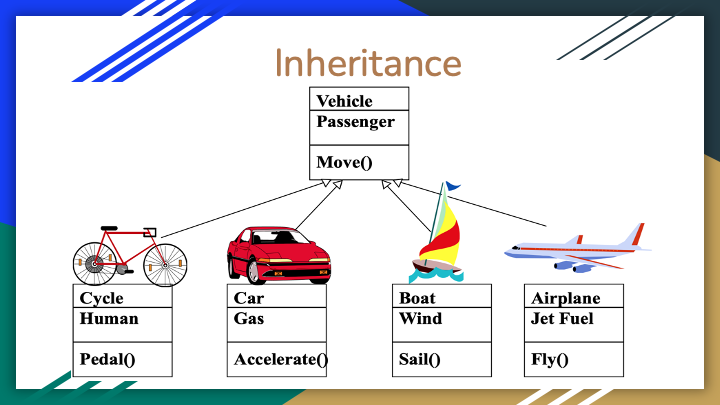

>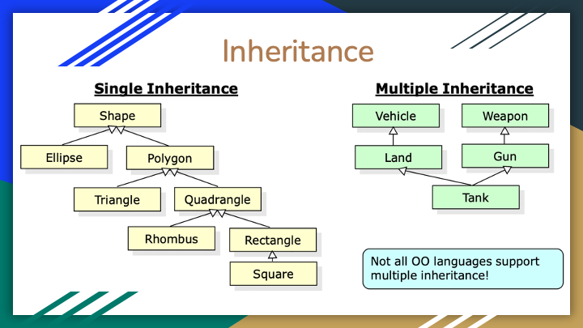

>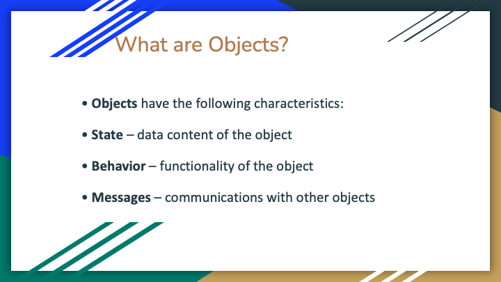

>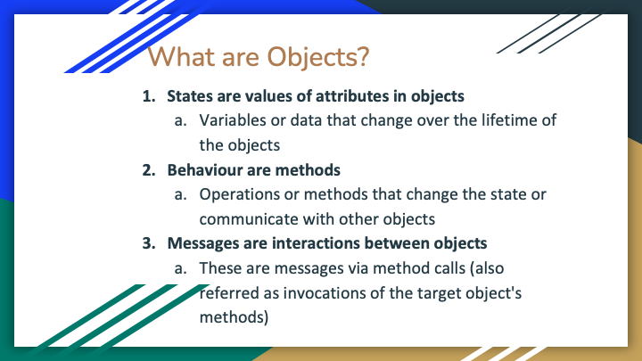

>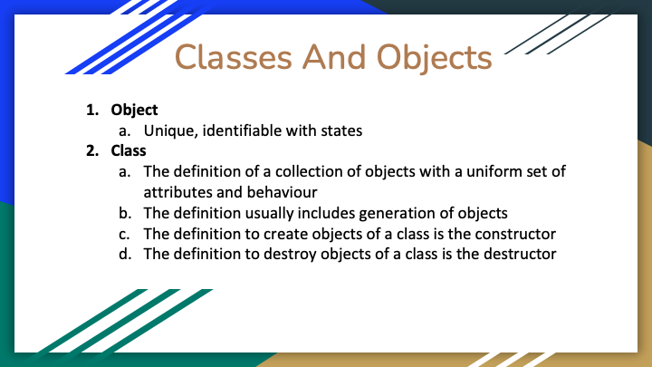

>

>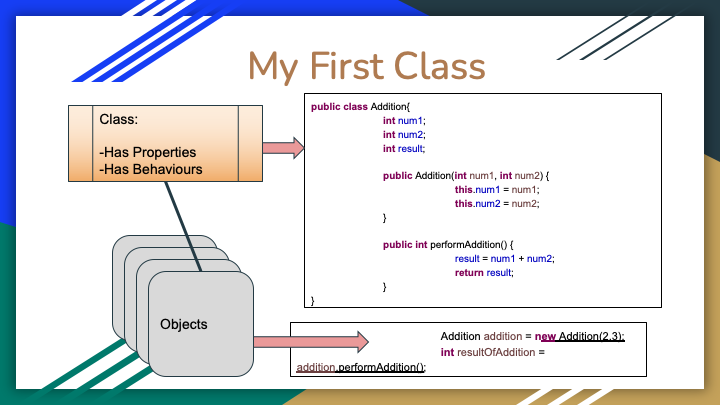

>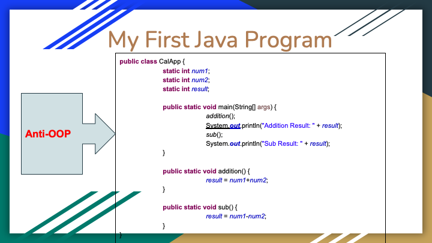

>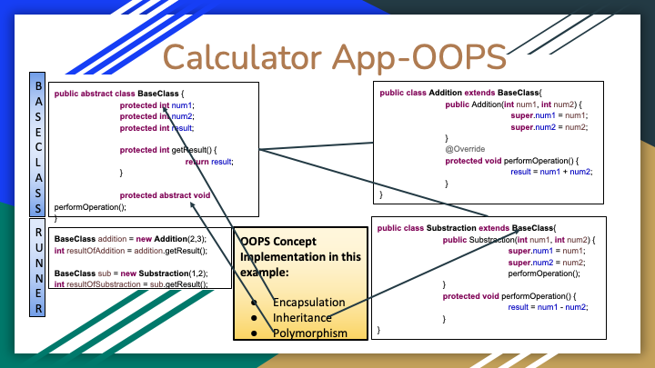

>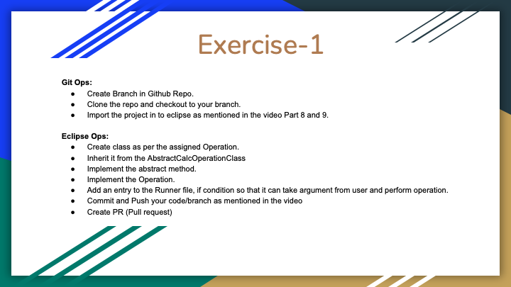

>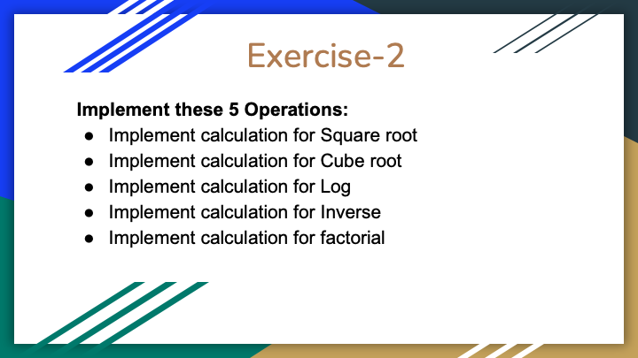

---
## 2. Create your First Maven Project.
---

* Read this to know basics of Maven: [Click Here](https://maven.apache.org/guides/getting-started/index.html)

* Use below screen shots to create your first maven project.

>

>

* Make sure you check "create a simple project(skip archetype selection)" . See below screen shot
>

####  What is Artifact ID, Group ID and Version and what is the use?
* GroupID + Artifact ID + version = Gives your project a uniq identity
* Also called as signature of the your project
* Group ID usually refers to your company and sub divisions
* Artifact ID refers to your project name
* For example, if you are working for a company lets say "infosys" and lets say you are working in a department whose name is "Center of Excellence or CoE". And assume your are automating an ecommerce application. Then group id and artifact id can be as below:
    * Group ID: ```com.infosys.coe```
    * Artifact ID: ```ECommerceAutomationTestFW```
    * Version: ```3.1.3```
* Full signature of the project on "maven repo" will be: ```com.infosys.coe.ECommerceAutomationTestFW:3.1.3```
* You will then upload your project artifacts and compiled code on online maven repository [ClickHere](https://mvnrepository.com/)
* This is important when some one else wants make use of your project. 
* They can simply refer to your project from online maven repository.
* This is how we use Selenium, Junit, TestNG, Cucumber libraries in our project.

>

>

>

* Add properties tag in xml to include compiler version as ```1.8```
>

* Update the project after every POM.xml change.
>

>

>

* Create the package
>

>

>

>

>

>

* You can run the project in two ways:
    * Using Run as "Java Application". 
        * For this right click on the File which you want to run
    * Run as "Maven Project"
        * For this right click on the Project and go to maven and click on "maven test"
>

* Right click on the project (not file)
>

>

---
### How to Import an existing Maven Project in Eclipse?
* First make sure the project with the same signature is not already imported in eclipse, else it will throw an error

* Click on File->Import
>

* Select Existing Maven project
>

* If the Project is already there in the eclipse with matching artifact id or group id, then pom check box will be greyed out and a message at the top will be displayed.
* Try to delete the previous project if not required or change eclipse workspace, form File-Switch Workspace option
>

* Browse and go to the folder of the proect, select the Root folder of the POM.xml file.
* Select the checkbox of pom.xml file
>

## How to create a New Maven Project Using Idea IntelliJ

* Click on Create new Project
>

* Select Maven from Left Panel
>

* Enter Group name and artifact name/Project name
>

* Project Created
>

[Click here for Code](src/main/java/com/vit/_1_MyFirstCalcProgram)

## Create your First Program - Calculator

[Click here for Code](src/main/java/com/vit/_1_MyFirstCalcProgram)

## Create your Second Program - Enhanced Calculator

[Click here for Code](src/main/java/com/vit/_2_MyAdvancedCalcProgram)
