# tutorial-automation-testing-java-basic

---
#### Description:
This repo contains the basics of automation testing and java which will covered as a part of Automation Testing Online Training.

---
#### Author:
Created By: Akash Tyagi. Reach me out at: akashdktyagi@gmail.com

---

>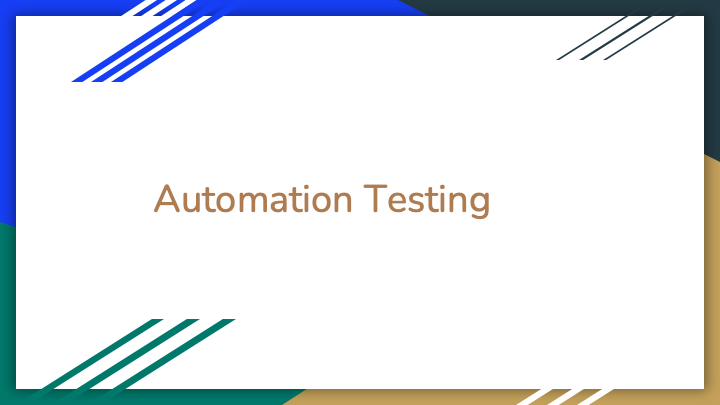

>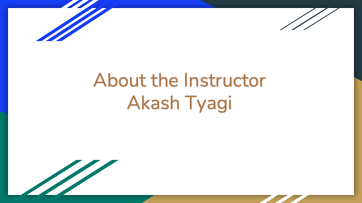

>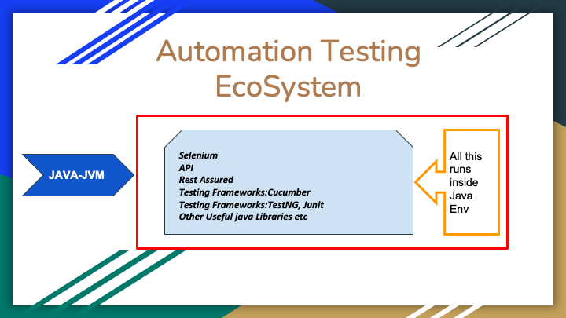

>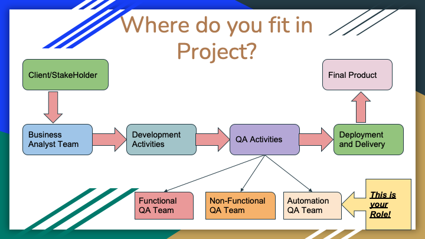

>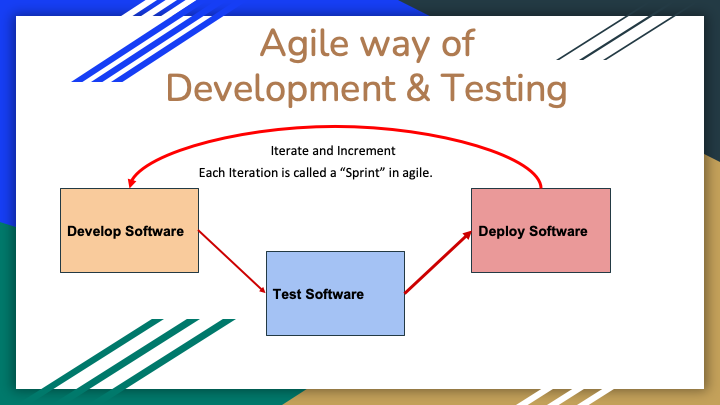

>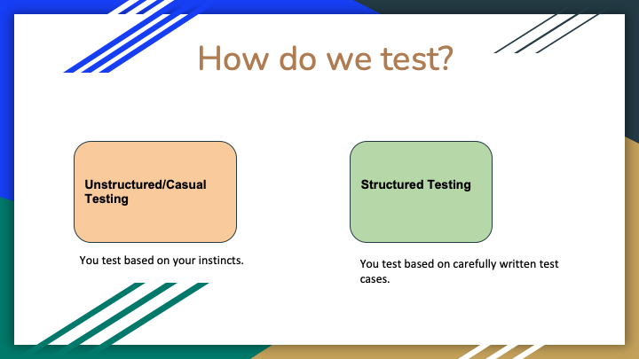

>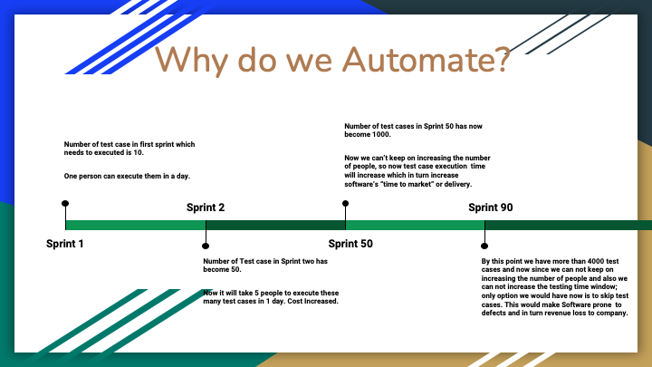

>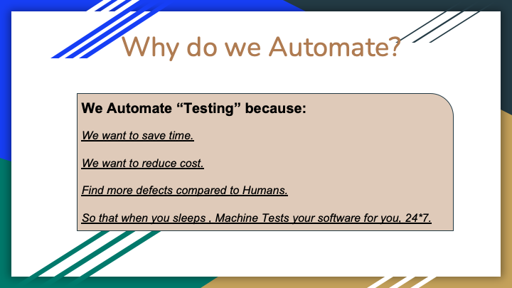

>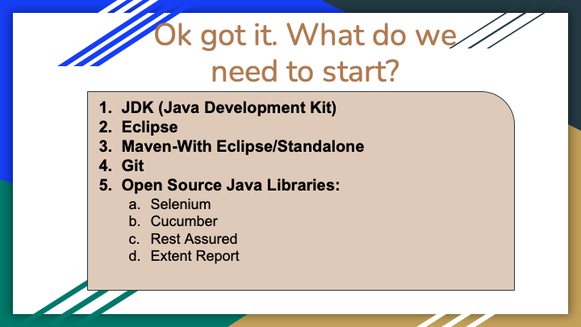

>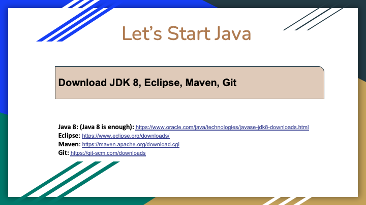

>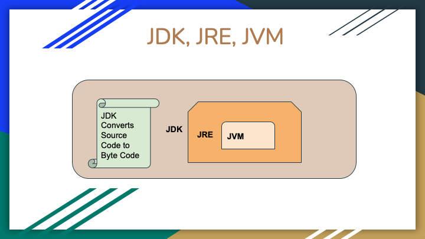

>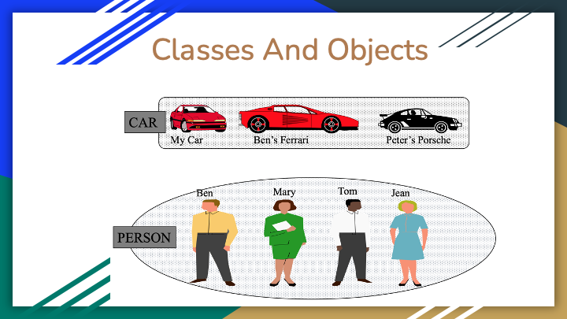

>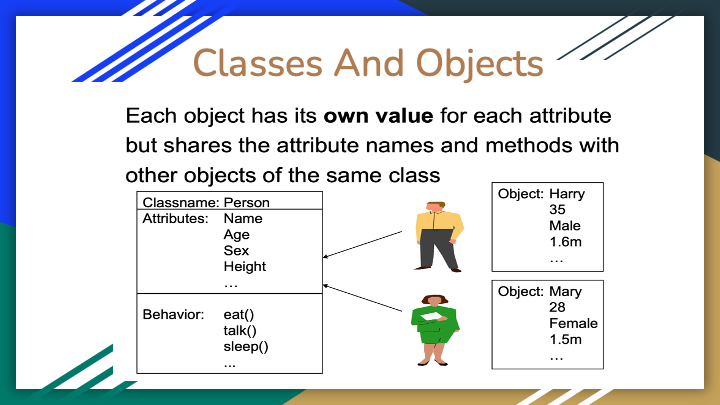

>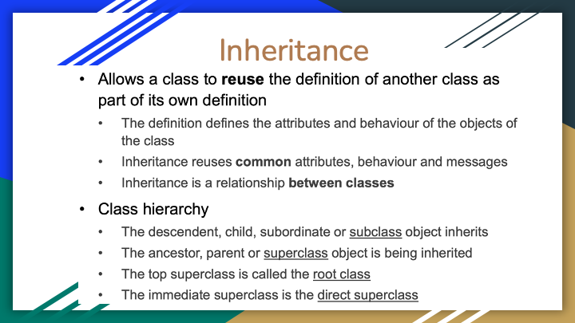

>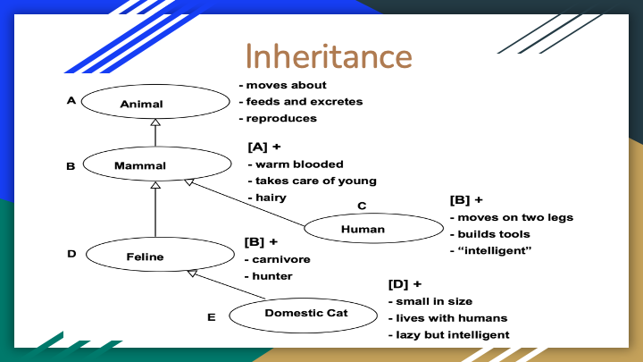

>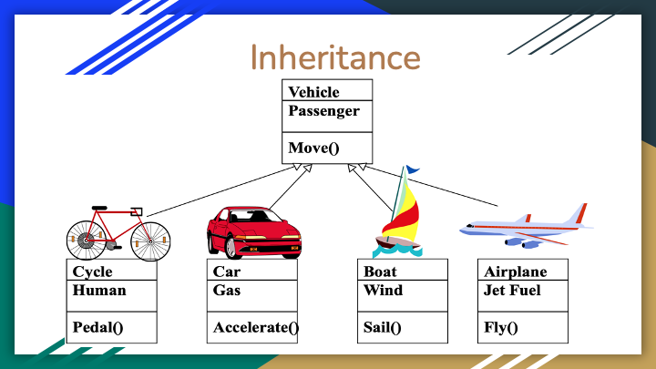

>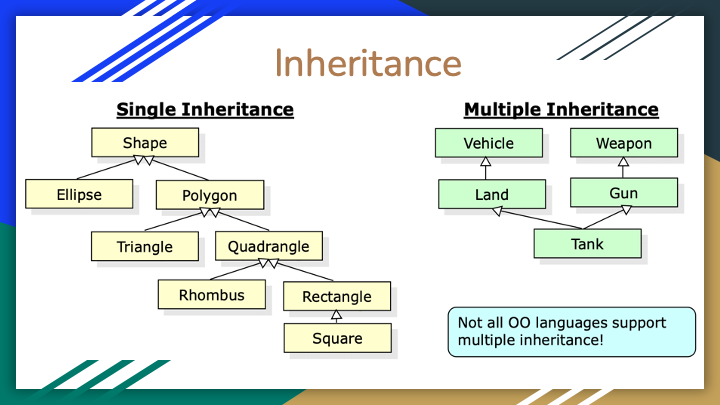

>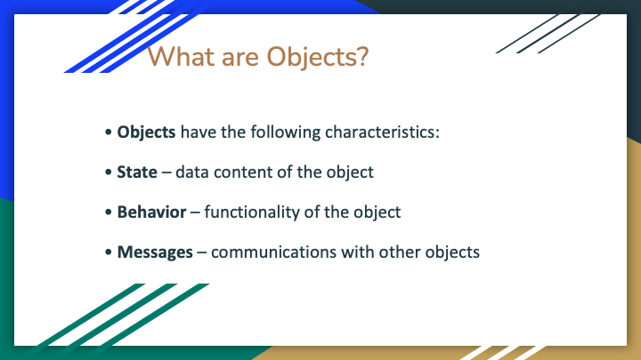

>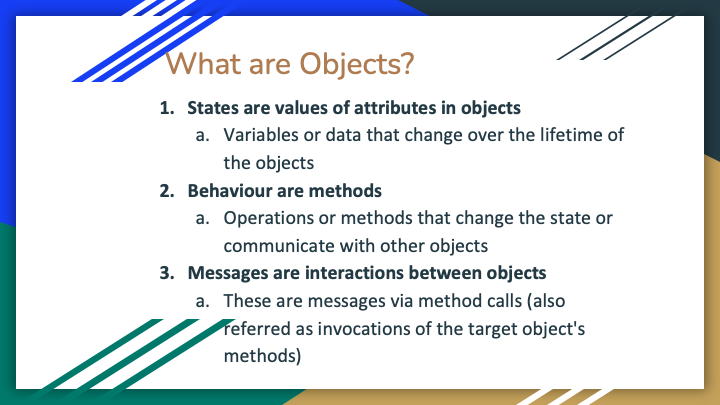

>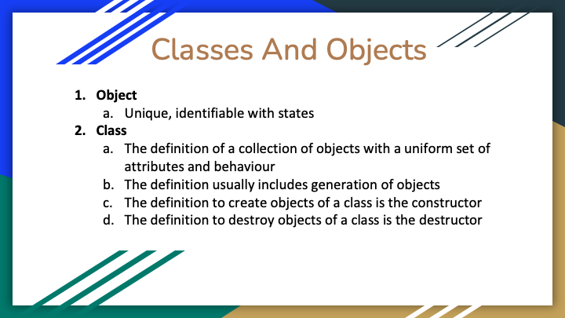

>

>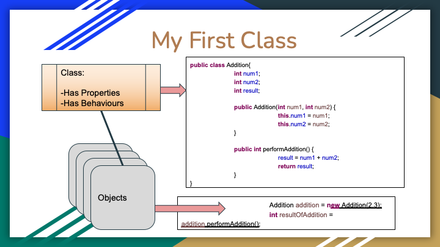

>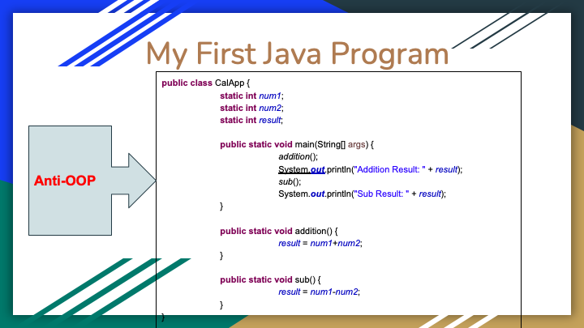

>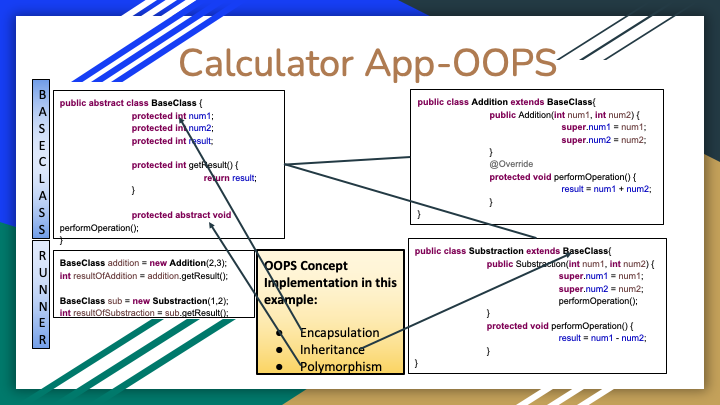

>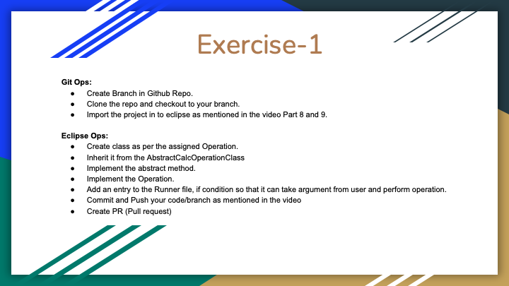

>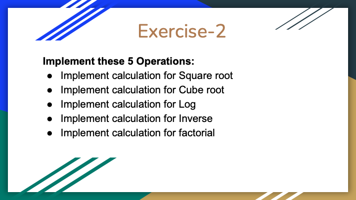

